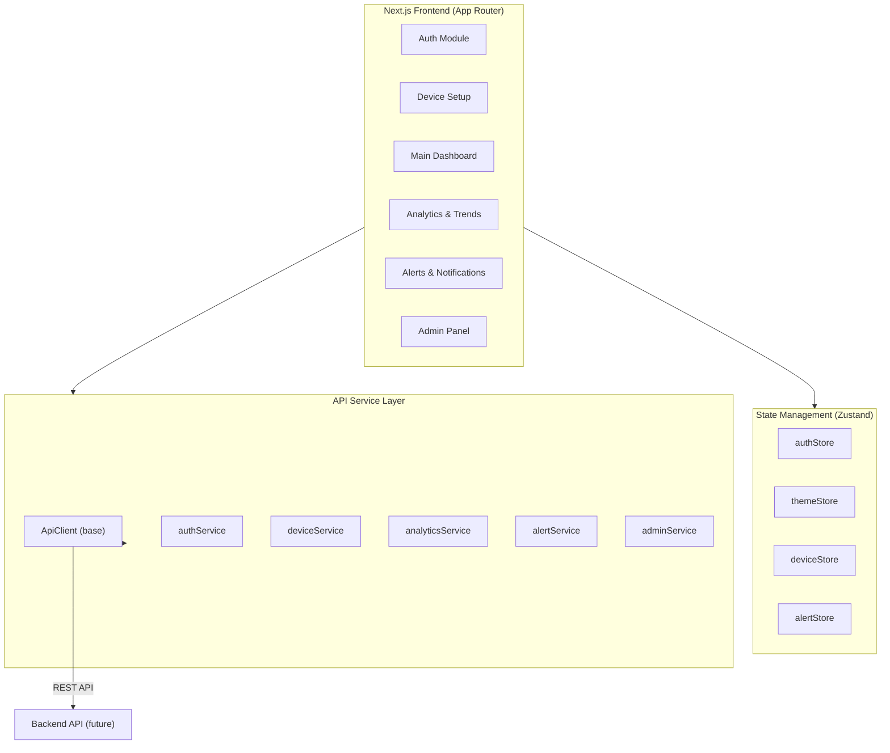
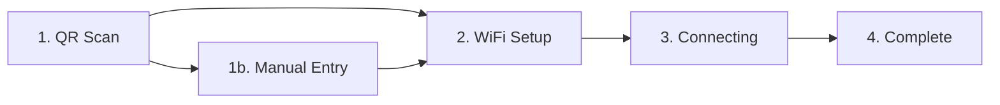
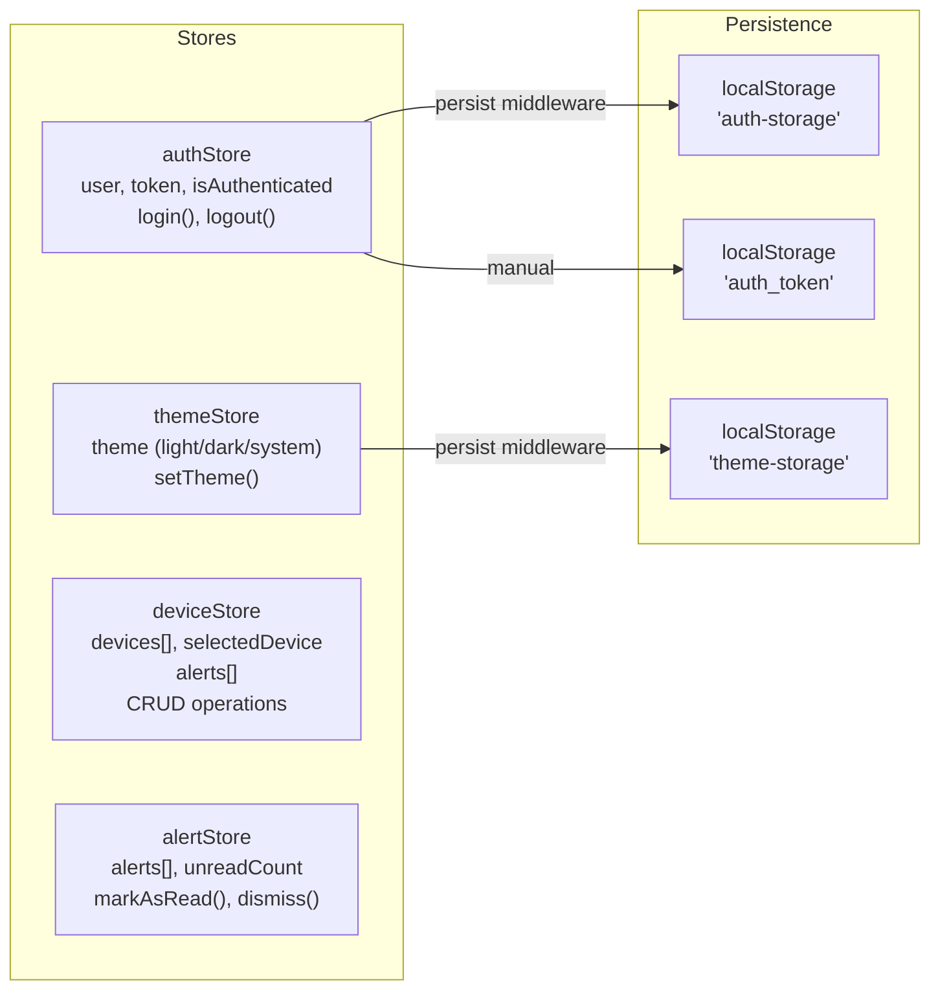
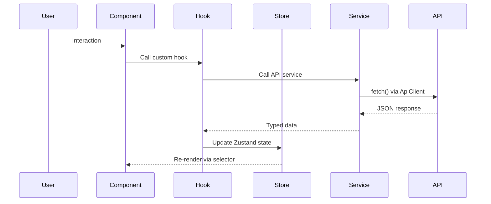

# Rawbin IoT Dashboard — Architecture Walkthrough

Complete analysis of the 6 markdown specification files and what it takes to convert them into a working Next.js project.

---

## High-Level Architecture



| Layer | Technology | Purpose |
|---|---|---|
| **Framework** | Next.js 14+ (App Router) | SSR, routing, layouts |
| **Language** | TypeScript | Type safety throughout |
| **Styling** | Tailwind CSS (class-based dark mode) | Utility-first CSS |
| **State** | Zustand + persist middleware | Global state + localStorage |
| **Charts** | Recharts | Bar, Line, Pie, Composed charts |
| **API** | Custom `ApiClient` fetch wrapper | REST communication |

---

## The 6 Modules

### 1. Auth + Shared Setup ([rawbin-auth-setup.md](file:///C:/Users/manme/.gemini/antigravity/worktrees/Internship%20Work/setup-iot-dashboard-architecture/rawbin-auth-setup.md))

The **foundation module** — sets up the entire project structure, shared types, stores, services, hooks, UI components, and configuration.

**What it provides:**
- All shared **types** (`User`, `Device`, `Alert`, `ApiResponse`, etc.)
- All **Zustand stores** (`authStore`, `themeStore`, `deviceStore`)
- **API client** base class with auth token injection
- **Auth & Device services**
- **Custom hooks** (`useAuth`, `useTheme`, `useFetch`)
- 6 **UI primitives** (Button, Card, Input, Modal, Toast, Badge)
- **Login form** + **Forgot password** form
- **Theme toggle** component
- **Root page** (`app/page.tsx`) = Login screen
- **Config files** (`tailwind.config.ts`, `tsconfig.json`, `next.config.ts`, `.env.local`)

---

### 2. Device Setup ([rawbin-device-setup.md](file:///C:/Users/manme/.gemini/antigravity/worktrees/Internship%20Work/setup-iot-dashboard-architecture/rawbin-device-setup.md))

Multi-step device onboarding wizard with 5 states.



**Components:** `DeviceSetupStepper`, `QRScanStep`, `ManualEntryStep`, `WiFiSetupStep`, `ConnectionStep`, `SuccessStep`
**Hook:** `useDeviceSetup`
**Extended Service:** `deviceService.pairDevice()`, `setupWiFi()`, `pollConnectionStatus()`

---

### 3. Main Dashboard ([rawbin-main-dashboard.md](file:///C:/Users/manme/.gemini/antigravity/worktrees/Internship%20Work/setup-iot-dashboard-architecture/rawbin-main-dashboard.md))

The primary authenticated view with layout shell, sidebar navigation, and metric widgets.

**Layout components:**
- `Sidebar` — collapsible nav (mobile drawer, desktop fixed)
- `Navbar` — profile dropdown, theme toggle
- `DashboardLayout` — auth guard + sidebar/navbar wrapper

**Dashboard widgets (8):**
- `SustainabilityScore` — hero score card with progress bar
- `MetricCard` (×3) — waste processed, compost generated, carbon avoided
- `CompositingProgress` — donut chart (Recharts `PieChart`)
- `UsageChart` — weekly bar chart (Recharts `BarChart`)
- `DeviceStatus` — device health + badge
- `StreakTracker` — composting streak gamification
- `QuickActions` — action button panel
- `ActivityLog` — timestamped activity feed

**Hook:** `useDashboardData`

---

### 4. Analytics & Trends ([rawbin-analytics-trends.md](file:///C:/Users/manme/.gemini/antigravity/worktrees/Internship%20Work/setup-iot-dashboard-architecture/rawbin-analytics-trends.md))

Advanced analytics with dual-axis charts, date filtering, and data export.

**Components:**
- `DateRangeFilter` — dropdown (week/month/quarter/year)
- `MoistureTemperatureChart` — dual-axis `ComposedChart` + stat boxes
- `InsightsCards` — trend cards with up/down/stable indicators
- `ActivityLogDetailed` — table with timestamps, actions, conditions
- `ComparisonToggle` — toggle for period-over-period comparison

**Hook:** `useAnalyticsData`
**Service:** `analyticsService`
**Types:** `AnalyticsMetric`, `Insight`, `ComparisonPeriod`

---

### 5. Alerts & Notifications ([rawbin-alerts-notifications.md](file:///C:/Users/manme/.gemini/antigravity/worktrees/Internship%20Work/setup-iot-dashboard-architecture/rawbin-alerts-notifications.md))

Notification center with severity-based grouping and management.

**3-Severity System:**
| Level | Icon | Color | Use Case |
|---|---|---|---|
| Critical | 🚨 | Red | Temp exceeded, device offline |
| Warning | ⚠️ | Amber | Low moisture, maintenance due |
| Info | ℹ️ | Blue | Cycle complete, update available |

**Components:** `AlertsHeader`, `AlertsFilter`, `AlertsList`, `AlertCard`, `EmptyState`
**Store:** `alertStore` (separate from `deviceStore.alerts`)
**Service:** `alertService` (includes SSE streaming via `EventSource`)

---

### 6. Admin Panel ([rawbin-admin-panel.md](file:///C:/Users/manme/.gemini/antigravity/worktrees/Internship%20Work/setup-iot-dashboard-architecture/rawbin-admin-panel.md))

Admin-only management dashboard with role-based access control.

**Components:**
- `AdminHeader` — stat cards (total users, devices, uptime, alerts)
- `SystemHealthCards` — API / Database / Storage health indicators
- `UserManagementTable` — searchable, role/status selectors
- `DeviceManagementTable` — searchable, status management, uptime color-coding
- `AdminActivityLog` — system event log

**Guards:** `AdminLayout` redirects non-admin users
**Service:** `adminService`

---

## Complete Folder Structure

```
rawbin-dashboard/
├── app/
│   ├── layout.tsx                          # Root layout (fonts, providers)
│   ├── page.tsx                            # Auth/Login screen
│   ├── device-setup/
│   │   └── page.tsx                        # Device onboarding page
│   └── dashboard/
│       ├── layout.tsx                      # Authenticated layout (sidebar + navbar)
│       ├── page.tsx                        # Main dashboard
│       ├── analytics/
│       │   └── page.tsx                    # Analytics & Trends
│       ├── alerts/
│       │   └── page.tsx                    # Alerts & Notifications
│       └── admin/
│           ├── layout.tsx                  # Admin guard layout
│           └── page.tsx                    # Admin Panel
│
├── components/
│   ├── ui/                                 # 6 shared primitives
│   │   ├── Button.tsx
│   │   ├── Card.tsx
│   │   ├── Input.tsx
│   │   ├── Modal.tsx
│   │   ├── Toast.tsx
│   │   └── Badge.tsx
│   ├── auth/                               # 2 auth components
│   │   ├── LoginForm.tsx
│   │   └── ForgotPasswordForm.tsx
│   ├── layout/                             # 3 layout components
│   │   ├── Sidebar.tsx
│   │   ├── Navbar.tsx
│   │   └── ThemeToggle.tsx
│   ├── device-setup/                       # 6 device setup components
│   │   ├── DeviceSetupStepper.tsx
│   │   └── steps/
│   │       ├── QRScanStep.tsx
│   │       ├── ManualEntryStep.tsx
│   │       ├── WiFiSetupStep.tsx
│   │       ├── ConnectionStep.tsx
│   │       └── SuccessStep.tsx
│   ├── dashboard/                          # 8 dashboard widgets
│   │   ├── SustainabilityScore.tsx
│   │   ├── MetricCard.tsx
│   │   ├── CompositingProgress.tsx
│   │   ├── UsageChart.tsx
│   │   ├── DeviceStatus.tsx
│   │   ├── StreakTracker.tsx
│   │   ├── QuickActions.tsx
│   │   └── ActivityLog.tsx
│   ├── analytics/                          # 5 analytics components
│   │   ├── DateRangeFilter.tsx
│   │   ├── MoistureTemperatureChart.tsx
│   │   ├── InsightsCards.tsx
│   │   ├── ActivityLogDetailed.tsx
│   │   └── ComparisonToggle.tsx
│   ├── alerts/                             # 5 alerts components
│   │   ├── AlertsHeader.tsx
│   │   ├── AlertsFilter.tsx
│   │   ├── AlertsList.tsx
│   │   ├── AlertCard.tsx
│   │   └── EmptyState.tsx
│   └── admin/                              # 5 admin components
│       ├── AdminHeader.tsx
│       ├── SystemHealthCards.tsx
│       ├── UserManagementTable.tsx
│       ├── DeviceManagementTable.tsx
│       └── AdminActivityLog.tsx
│
├── store/                                  # 4 Zustand stores
│   ├── authStore.ts
│   ├── themeStore.ts
│   ├── deviceStore.ts
│   └── alertStore.ts
│
├── services/                               # 6 API service modules
│   ├── api.ts                              # Base ApiClient
│   ├── auth.ts
│   ├── devices.ts
│   ├── analytics.ts
│   ├── alerts.ts
│   └── admin.ts
│
├── types/                                  # 4 type definition files
│   ├── index.ts                            # Core types (User, Device, Alert, etc.)
│   ├── auth.ts                             # Login/Register request/response
│   ├── device.ts                           # DeviceMetrics, CompostingCycle
│   └── analytics.ts                        # AnalyticsMetric, Insight, ComparisonPeriod
│
├── hooks/                                  # 6 custom hooks
│   ├── useAuth.ts
│   ├── useTheme.ts
│   ├── useFetch.ts
│   ├── useDeviceSetup.ts
│   ├── useDashboardData.ts
│   └── useAnalyticsData.ts
│
├── constants/
│   └── index.ts
│
├── utils/
│   ├── cn.ts                               # clsx/twMerge helper
│   └── format.ts                           # Formatting utilities
│
├── styles/
│   └── globals.css                         # Tailwind base styles
│
├── .env.local
├── next.config.ts
├── tailwind.config.ts
├── tsconfig.json
├── postcss.config.js
└── package.json
```

> **~60 files** total across the project.

---

## Dependencies Needed

### Production Dependencies

| Package | Version | Purpose |
|---|---|---|
| `next` | `^14` or `^15` | React framework |
| `react` | `^18` or `^19` | UI library |
| `react-dom` | `^18` or `^19` | DOM rendering |
| `zustand` | `^4` or `^5` | State management |
| `recharts` | `^2` | Charts (Pie, Bar, Line, Composed) |
| `tailwindcss` | `^3` or `^4` | Utility CSS |
| `postcss` | `^8` | CSS processing |
| `autoprefixer` | `^10` | Vendor prefixes |

### Dev Dependencies

| Package | Version | Purpose |
|---|---|---|
| `typescript` | `^5` | Type checking |
| `@types/react` | `^18`/`^19` | React type defs |
| `@types/node` | `^20` | Node type defs |

### Optional / Future Dependencies

| Package | Purpose | Referenced In |
|---|---|---|
| `clsx` + `tailwind-merge` | `cn()` utility | `utils/cn.ts` |
| `jsQR` or `html5-qrcode` | Real QR scanning | Device Setup |
| `@sentry/nextjs` | Error tracking | Integration checklist |
| `posthog-js` | Analytics | Integration checklist |

---

## State Management Architecture



> [!WARNING]
> **Potential issue:** `authStore` uses both Zustand persist (key: `auth-storage`) AND a manual `localStorage.setItem('auth_token', ...)`. The `ApiClient` reads from `auth_token`. This dual-storage approach works but could get out of sync. Consider consolidating.

> [!NOTE]
> `deviceStore` and `alertStore` are NOT persisted — they re-fetch from API on each page load.

---

## Data Flow Pattern



Currently, all API calls use **mock data** embedded directly in pages/components. The service layer is wired but not called in most places — it's ready for the real backend swap.

---

## Cross-Cutting Concerns

### Authentication Guards
- **Root layout** → no guard (login page)
- **`dashboard/layout.tsx`** → redirects to `/` if `!isAuthenticated`
- **`device-setup/page.tsx`** → redirects to `/` if `!isAuthenticated`
- **`dashboard/admin/layout.tsx`** → redirects to `/dashboard` if `user.role !== 'admin'`
- **`dashboard/admin/page.tsx`** → renders "Access denied" if not admin (double guard)

### Theming
- Tailwind `darkMode: 'class'` — toggles `dark` class on `<html>`
- `useTheme` hook handles `system` preference detection via `matchMedia`
- Theme persists in `localStorage` via Zustand

### Responsive Design
All screens are mobile-first with Tailwind breakpoints:
- Sidebar: `translate-x` toggle on mobile, fixed on `md:`
- Grids: `grid-cols-1` → `md:grid-cols-2/3` → `lg:grid-cols-2/3`
- All interactive targets: `min-h-[44px]` for accessibility

---

## Integration Steps (to Build the Project)

### Phase 1: Project Bootstrap
1. Initialize Next.js with TypeScript + Tailwind
2. Create `globals.css` with Tailwind directives
3. Set up `tailwind.config.ts`, `tsconfig.json`, `next.config.ts`
4. Create `.env.local`

### Phase 2: Foundation Layer
5. Create all **type definitions** (`types/`)
6. Create **utility functions** (`utils/cn.ts`, `utils/format.ts`)
7. Create **constants** (`constants/index.ts`)
8. Create all **Zustand stores** (`store/`)
9. Create the **API client** and all **services** (`services/`)
10. Create all **custom hooks** (`hooks/`)

### Phase 3: UI Components
11. Build all 6 **UI primitives** (`components/ui/`)
12. Build **layout components** — Sidebar, Navbar, ThemeToggle (`components/layout/`)

### Phase 4: Pages (in order)
13. **Auth page** — `app/page.tsx` + `components/auth/`
14. **Root layout** — `app/layout.tsx`
15. **Dashboard layout** — `app/dashboard/layout.tsx`
16. **Main Dashboard** — `app/dashboard/page.tsx` + `components/dashboard/` (8 widgets)
17. **Device Setup** — `app/device-setup/page.tsx` + `components/device-setup/` (6 components)
18. **Analytics** — `app/dashboard/analytics/page.tsx` + `components/analytics/` (5 components)
19. **Alerts** — `app/dashboard/alerts/page.tsx` + `components/alerts/` (5 components)
20. **Admin** — `app/dashboard/admin/` (layout + page) + `components/admin/` (5 components)

### Phase 5: Verify & Polish
21. Run `npm run dev` and test all routes
22. Verify dark mode toggle works across all pages
23. Test mobile responsive layouts
24. Verify auth guard redirects
25. Verify admin role guard

---

## Issues & Notes Found in the Specs

> [!WARNING]
> ### Minor bugs in the markdown source
> 1. **`DeviceSetupStepper.tsx` line 113** — calls `handleQRSSuccess` (typo, should be `handleQRSuccess`)
> 2. **`Input.tsx`** — uses `ReactNode` for the `icon` prop but doesn't import it
> 3. **`AlertsFilter.tsx`** — imports `AlertSeverity` from `@/app/dashboard/alerts/page` (circular dependency risk — should be in `types/`)
> 4. **`AlertsList.tsx`** and **`AlertCard.tsx`** — import `Alert` type from `@/app/dashboard/alerts/page` (same circular dependency risk)
> 5. **`Toast.tsx`** — listed in the folder structure but no implementation provided
> 6. **`ForgotPasswordForm.tsx`** — listed but no implementation provided
> 7. **`constants/index.ts`** — listed but no implementation provided
> 8. **`utils/cn.ts`** and **`utils/format.ts`** — listed but no implementation provided

> [!IMPORTANT]
> ### Design decisions needed
> 1. **Tailwind version**: The specs use Tailwind v3 class syntax. Should we use Tailwind v3 or v4?
> 2. **Next.js version**: Specs say App Router. Next.js 14 or 15?
> 3. **Mock data vs API routes**: Should we create Next.js API routes (`app/api/`) to simulate the backend, or keep mock data inline?
> 4. **Missing `ReactNode` import** in `Input.tsx` — needs `import { ReactNode } from 'react'`
> 5. **Alert type location** — should live in `types/` not re-declared in page files

---

## Summary

| Metric | Count |
|---|---|
| **Total files to create** | ~60 |
| **Page routes** | 6 (`/`, `/device-setup`, `/dashboard`, `/dashboard/analytics`, `/dashboard/alerts`, `/dashboard/admin`) |
| **Components** | ~36 |
| **Stores** | 4 |
| **Services** | 6 |
| **Hooks** | 6 |
| **Type files** | 4 |
| **NPM packages** | 8 production + 3 dev |

The codebase is well-structured with clear separation of concerns. All mock data is inline and ready to swap for real API calls. The design system uses Tailwind with an emerald/green primary palette, full dark mode, and accessibility considerations (44px tap targets).
